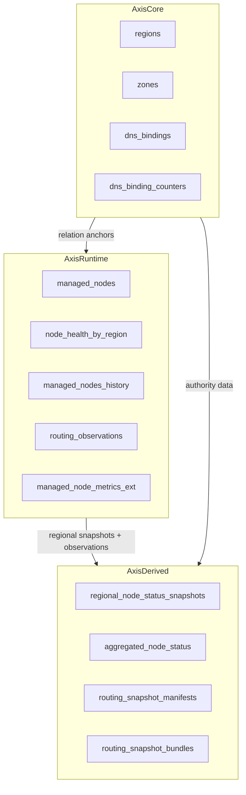

# Axis 表说明

## 总览

`Axis` 是控制平面，不是网盘业务库。  
它的表不能一刀切地都按“全局强一致业务真相”处理，而应按真实数据性质分层：

- `AxisCore`：静态主数据与全局唯一分配表
- `AxisRuntime`：区域本地热写与节点运行态
- `AxisDerived`：中心接收、聚合生成与单点派生的只读产物

## 目标数据平面

## 表分层结论

| 表名 | 逻辑组 | 数据性质 | 最终建议策略 |
| --- | --- | --- | --- |
| `regions` | `AxisCore` | 静态主数据 | 亚洲权威写 + 全局静态同步 |
| `zones` | `AxisCore` | 静态主数据 | 亚洲权威写 + 全局静态同步 |
| `dns_bindings` | `AxisCore` | 全局命名权威表 | 亚洲权威写 + 单向复制 |
| `dns_binding_counters` | `AxisCore` | 全局序号分配器 | 亚洲权威写 + 单向复制 |
| `managed_nodes` | `AxisCore` | 全局节点身份表 | 亚洲权威写 + 全局静态同步 |
| `node_health_by_region` | `AxisRuntime` | 区域健康表 | 区域本地化 |
| `managed_nodes_history` | `AxisRuntime` | 区域运行态历史 | 区域本地化 |
| `routing_observations` | `AxisRuntime` | 区域观测累加表 | 区域本地化 |
| `managed_node_metrics_ext` | `AxisRuntime` | 区域指标扩展表 | 区域本地化 |
| `regional_node_status_snapshots` | `AxisDerived` | 区域快照接收层 | 各区发布到亚洲中心 |
| `aggregated_node_status` | `AxisDerived` | 全局一致读模型 | 亚洲中心聚合生成 + 全区只读 |
| `routing_snapshot_manifests` | `AxisDerived` | 单权威派生产物 | 亚洲单点生成 + 全区复制 |
| `routing_snapshot_bundles` | `AxisDerived` | 单权威派生产物 | 亚洲单点生成 + 全区复制 |

---

## `managed_nodes`

- 表功能：全球节点身份表，保存节点身份、归属、命名空间与静态主数据锚点。
- 主键 / 关键唯一约束：
  - 主键：`uuid`
  - 唯一约束：`management_address`、`dns_label`、`dns_name`
- 主要写入来源：
  - `POST /api/v1/nodes/register`
  - DNS 绑定成功后的镜像回写
- 容易遗漏的自动维护链路：
  - `region` / `zone` 是全局调度读模型的文本镜像
  - `region_uuid` / `zone_uuid` 是静态主数据关系锚点
  - `dns_label` / `dns_name` 是显示镜像，权威绑定关系在 `dns_bindings`
- 数据性质：全局身份真相表
- 最终建议策略：`亚洲权威写 + 全局静态同步`
- 理由：节点是谁、属于哪个 region/zone、占用哪个 DNS 名称，必须是全局唯一且跨区一致的，不应再被高频心跳覆盖。

### 字段拆分建议

- 建议继续保留在主表：
  - 节点身份：`uuid`、`hostname`、`management_address`
  - 热路径读模型：`region`、`zone`
  - 关系锚点：`region_uuid`、`zone_uuid`
  - DNS 显示镜像：`dns_label`、`dns_name`
  - 轻量身份时间字段：`created_at`、`updated_at`
- 建议迁出到区域健康层：
  - `status`
  - `last_seen_at`、`last_reported_at`
  - 大字段：`monitoring_snapshot`、`disk_details`
  - 高频指标：`cpu_usage_percent`、`memory_total_gb`、`memory_used_gb`、`memory_usage_percent`
  - 高频指标：`swap_total_gb`、`swap_used_gb`、`swap_usage_percent`、`disk_usage_percent`
- 推荐扩展表方向：`node_health_by_region` + `managed_node_metrics_ext`
- 理由：
  - 这些字段由 `axis-node` 高频上报，天然属于区域观测而非全球身份
  - JSON 和多组资源指标会放大 TiCDC 复制成本与主表写放大
  - 控制面读路径应聚合“身份 + 本区健康”，而不是让身份表直接承载运行态

## `node_health_by_region`

- 表功能：按 `(observer_region, node_uuid)` 记录区域控制面对节点的健康判断与最近上报时间。
- 主键 / 关键唯一约束：
  - 主键：`observer_region, node_uuid`
- 主要写入来源：
  - `POST /api/v1/nodes/report`
  - 后台 `NodeMonitor` 超时将本区健康收敛为 `down`
- 容易遗漏的自动维护链路：
  - `service-list` / `service-show` / assign / routing snapshot 读取的是“节点身份 + 归属 region 对应的健康记录”的聚合视图
  - `service-up` / `service-down` 仍只影响 Worker 外部流量，不作为健康事实来源
  - `managed_node_metrics_ext` 当前仍作为区域健康层的指标扩展表使用
- 数据性质：区域健康表
- 最终建议策略：`区域本地化`
- 理由：健康状态是观察结果，不同区域允许短时差异；把它单独建模后，就不会污染全局身份真相。

## `managed_nodes_history`

- 表功能：活动节点被新 UUID 替换时的归档历史表，保存被替换节点的完整运行态快照。
- 主键 / 关键唯一约束：
  - 主键：`history_id`
- 主要写入来源：
  - `Register()` 命中新旧 UUID 冲突时，归档旧 active 节点
- 容易遗漏的自动维护链路：
  - 只有“同 `management_address` 被新 UUID 替换”才写，不是全量审计表
  - 归档内容包含 `region/region_uuid`、`zone/zone_uuid`、`dns_*`、归档时的 home-region 健康快照、资源指标、`archive_reason`、`replaced_by_uuid`
- 数据性质：区域运行态历史表
- 最终建议策略：`区域本地化`
- 理由：它依附 `managed_nodes` 生命周期，属于节点归属区的历史，不需要做全局强一致主写。

## `dns_bindings`

- 表功能：节点 UUID 到稳定 `dl-*` 域名的中心权威绑定表。
- 主键 / 关键唯一约束：
  - 主键：`node_uuid`
  - 关键唯一性：`dns_label`、`dns_name`、序号分配
- 主要写入来源：
  - 节点首次带公网 IP 上报时 `AllocateForNode()`
  - 后续心跳里的 `UpdateLastPublicIP()`
  - 一次性迁移 / 修复场景下的 `SeedFromManagedNodes()`
- 容易遗漏的自动维护链路：
  - `managed_nodes.dns_label/dns_name` 只是镜像，真正权威在 `dns_bindings`
  - 首次分配会同时推进序号分配器
- 数据性质：全局命名权威表
- 最终建议策略：`单权威生成+复制`
- 理由：它本质是全局命名空间，不能由多区并发生成。若后续确定控制面权威区为 `asia`，则应由 `asia` 单点写入。

## `dns_binding_counters`

- 表功能：按 `(zone, prefix)` 维护下一个可分配 DNS 序号。
- 主键 / 关键唯一约束：
  - 主键：`zone, record_prefix`
- 主要写入来源：
  - `AllocateForNode()` 事务内推进序号
  - `EnsureCounterFloor()` 校正最小可分配序号
- 容易遗漏的自动维护链路：
  - 它和 `dns_bindings` 是成对工作的，全局唯一语义比普通表更强
  - 物理字段语义是 `next_sequence`，表示下一次应分配的序号，而不是已分配的最后一个序号
- 数据性质：全局序号分配器
- 最终建议策略：`单权威生成+复制`
- 理由：这是典型单调计数器，多区同时写会天然冲突。

## `regions`

- 表功能：区域主数据表。
- 主键 / 关键唯一约束：
  - 主键：`uuid`
  - 关键字段：`name`
- 主要写入来源：
  - `POST /api/v1/regions`
  - CLI `region-create`
- 容易遗漏的自动维护链路：
  - `AXIS_AUTO_SCHEMA_UPGRADE` 开启时，会优先按配置补齐 `regions`
- 数据性质：静态主数据
- 最终建议策略：`全局静态同步`
- 理由：应由单点创建后扩散到全区，不应各区分别创建。

## `zones`

- 表功能：可用区主数据表，显式从属于 `regions`。
- 主键 / 关键唯一约束：
  - 主键：`uuid`
  - 关键字段：`region_uuid`、`name`
  - 唯一约束：`region_uuid + name`
- 主要写入来源：
  - `POST /api/v1/zones`
  - CLI `zone-create --region-uuid`
- 容易遗漏的自动维护链路：
  - `AXIS_AUTO_SCHEMA_UPGRADE` 开启时，会优先按配置补齐 `regions/zones`
  - `RegionService.DeleteByUUID()` 会先检查该 `region` 下是否仍有 `zones`
  - `ZoneService.DeleteByUUID()` 删除 zone 时会先清理该 `zone_uuid` 下的活动节点
- 数据性质：静态主数据
- 最终建议策略：`全局静态同步`
- 理由：和 `regions` 一样是低频静态字典，应一次创建、全局同步；但 zone 不再是全局唯一名，而是区域内唯一名。

## `routing_observations`

- 表功能：按 `(source_colo, target_node_uuid)` 聚合路由观测累计值。
- 主键 / 关键唯一约束：
  - 主键：`source_colo, target_node_uuid`
- 主要写入来源：
  - `POST /api/v1/routing/observations`
  - `UpsertMany()` 累加成功延迟、成功数、错误数、样本数
- 容易遗漏的自动维护链路：
  - 这是累加表，不是滑窗表
  - 当前没有 TTL 清理或衰减逻辑
- 数据性质：区域观测运行态
- 最终建议策略：`区域本地化`
- 理由：观测值天然带地域性，多区同时对同一主键累加会放大冲突；更适合按采集区写、本地消费或后续聚合。

## `regional_node_status_snapshots`

- 表功能：亚洲中心接收各区域最新节点状态快照的中转表。
- 主键 / 关键唯一约束：
  - 主键：`source_region, node_uuid`
- 主要写入来源：
  - 区域快照发布 worker
  - 内部接收接口 `POST /api/v1/internal/aggregation/regional-snapshots`
- 容易遗漏的自动维护链路：
  - 这是“区域发布到中心”的接收层，不是最终展示真相
  - 允许各区域按自己的写入节奏覆盖同一 `source_region` 下的最新快照
  - 为 `aggregated_node_status` 提供 home-region 状态输入
- 数据性质：区域快照接收层
- 最终建议策略：`各区发布到亚洲中心`
- 理由：它承接的是区域运行态的中心副本，目标是为后续聚合服务，而不是替代本地运行态表。

## `aggregated_node_status`

- 表功能：所有展示、调度、路由相关读路径统一读取的全局一致读模型。
- 主键 / 关键唯一约束：
  - 主键：`node_uuid`
- 主要写入来源：
  - 中心聚合 worker
- 容易遗漏的自动维护链路：
  - 节点身份字段来自 `managed_nodes`
  - 节点最终状态只采纳 `home_region` 的最新快照
  - `stale=true` 时即使原始状态为 `up`，最终也可以降级为 `down`
  - `service-list` / `service-show` / `assign` / routing snapshot 读的都应该是这张表
- 数据性质：全局一致读模型
- 最终建议策略：`亚洲中心聚合生成 + 全区只读`
- 理由：它不参与各区运行态主写，只负责把“分区写入的局部真相”收敛成“全局统一展示真相”。

## `routing_snapshot_manifests`

- 表功能：每次路由快照的总清单，保存版本、TTL、全局/区域/zone 候选引用。
- 主键 / 关键唯一约束：
  - 主键：`version`
- 主要写入来源：
  - 后台 `RoutingSnapshotPublisher`
  - 管理接口 `POST /api/v1/routing/snapshots/generate`
- 容易遗漏的自动维护链路：
  - 只有在启用 publisher 时，后台发布 worker 才会启动并周期生成新版本
  - 快照输入来自当前 `managed_nodes` 的文本 `region/zone` 读模型与 `routing_observations`
  - 代码里没有自动清理过期快照
- 数据性质：单权威派生产物
- 最终建议策略：`单权威生成+复制`
- 理由：它不是同一行热更新表，而是追加型版本表。多 publisher 会直接制造额外 `version`。

## `routing_snapshot_bundles`

- 表功能：与 manifest 同步生成的分区域快照明细。
- 主键 / 关键唯一约束：
  - 主键：`version, region_name`
- 主要写入来源：
  - `GenerateAndStore()` 与 `routing_snapshot_manifests` 同批生成
- 容易遗漏的自动维护链路：
  - 它与 manifest 必须成对看，不能单独作为运行态表理解
  - 每个 bundle 的候选集同样依赖当前 `managed_nodes` 与 `routing_observations` 的组合输入
- 数据性质：单权威派生产物
- 最终建议策略：`单权威生成+复制`
- 理由：和 manifest 一样，应由单点生成，再向各区只读扩散。

---

## 逻辑数据库边界

### `AxisCore`

- 包含：`regions`、`zones`、`managed_nodes`、`dns_bindings`、`dns_binding_counters`
- 角色：亚洲权威真相层
- 特征：
  - 低频主数据
  - 节点身份与命名空间锚点
  - 全局唯一命名 / 序号分配
  - 不适合多区平级主写

### `AxisRuntime`

- 包含：`node_health_by_region`、`managed_nodes_history`、`routing_observations`
- 可扩展：`managed_node_metrics_ext`
- 角色：区域本地运行态层
- 特征：
  - 高频热写
  - 允许天然地域差异
  - 不应再纳入全区严格字节级一致性考核

### `AxisDerived`

- 包含：`regional_node_status_snapshots`、`aggregated_node_status`、`routing_snapshot_manifests`、`routing_snapshot_bundles`
- 角色：亚洲中心接收与单点派生层
- 特征：
  - 输入依赖 `AxisCore + AxisRuntime`
  - 先接收各区域发布的快照，再聚合生成全局一致读模型
  - 产物适合全区只读消费
  - 不适合多 publisher 并发生成

---

## TiDB 承载建议

### TiCDC

- 不再继续使用单一 `AXIS.*` 整库复制语义
- 建议升级为按逻辑组复制：
  - `AxisCore`：亚洲单向复制到北美/澳洲/欧洲
- `AxisRuntime`：区域本地化，不参与全区严格互联；`node_health_by_region` 与 `managed_node_metrics_ext` 都按区域主写
  - `AxisDerived`：亚洲接收各区快照并生成聚合表，再单向复制到北美/澳洲/欧洲
- DDL 仍应保持手工前置对齐，不依赖 TiCDC 传播

### HAProxy

- 不做 SQL 级按表判断
- 应提供两个明确入口：
  - `regional_tidb`：区域本地运行态入口
  - `asia_authoritative_tidb`：亚洲权威入口
- 上层服务按业务语义选择入口，而不是让代理层猜测访问哪类表

### 应用侧

- `Axis` 后续应明确区分：
  - 主数据 / 命名权威访问走亚洲权威入口
  - 节点心跳 / 健康写入走区域入口
  - 快照生成只在亚洲权威实例执行

---

## 总结

`Axis` 不适合继续按 `AXIS.*` 整库一刀切地做全区多主热写。更合理的目标形态是：

- `AxisCore`：亚洲权威写，负责静态主数据、节点身份和全局唯一分配
- `AxisRuntime`：区域本地化，负责节点健康、指标与观测累加
- `AxisDerived`：亚洲中心先接收各区快照并生成 `aggregated_node_status`，再把统一读模型与 routing 派生产物向其他区复制
- `managed_nodes` 主表只保留全局身份与命名空间字段；健康状态和高频指标由 `node_health_by_region` / `managed_node_metrics_ext` 承担
